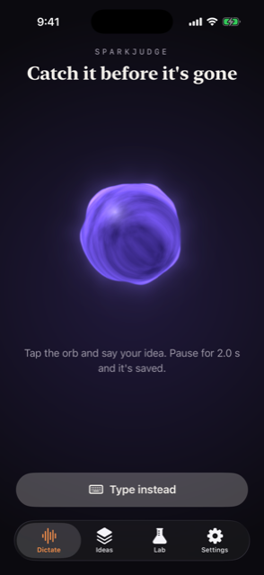
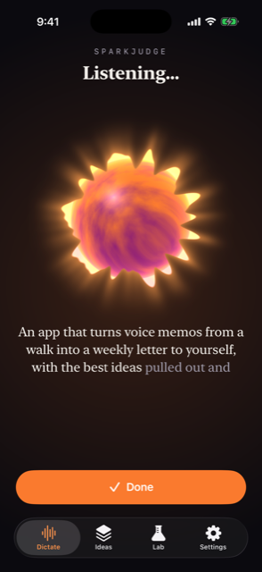
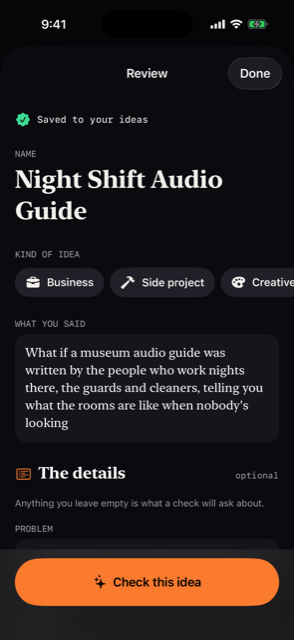
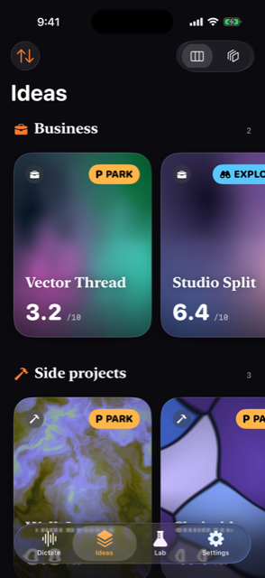
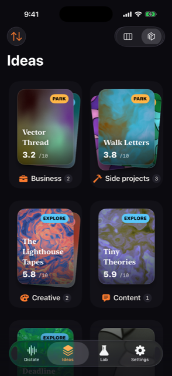
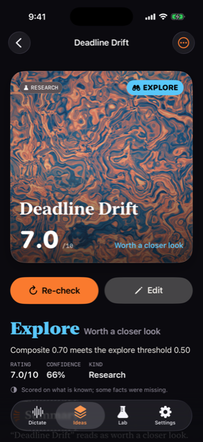

# Sparkjudge (iOS)

Catch an idea before it's gone: tap the orb, say it, and it types out as you
speak. Stop talking and the take ends, is saved at once, and opens for review.
Then check it with ideacheck and get a card with a rating out of 10 and a
verdict: Build, Explore, Park or Kill.

| Home | Dictating | Review | Ideas | Piles | Detail |
|---|---|---|---|---|---|
|  |  |  |  |  |  |

## Build

The Xcode project is generated from `project.yml`. It is not committed, so there
is one source of truth and no merge conflicts in a `.pbxproj`.

```sh
cd apps/ios
xcodegen generate
xcodebuild -scheme Sparkjudge -destination 'platform=iOS Simulator,name=iPhone 16 Pro' build test
open Sparkjudge.xcodeproj
```

You need Xcode 26 with the iOS 26 SDK, plus the Metal Toolchain
(`xcodebuild -downloadComponent MetalToolchain`) for the shaders. The deployment
target is iOS 26.0, so the simulator must run iOS 26 (an iOS 18 "iPhone 16 Pro"
will not match). There is no team id: it is set up for simulator builds. Set
`DEVELOPMENT_TEAM` in `project.yml` to run it on a phone.

`scripts/screenshots.sh <simulator-udid>` launches the built app with demo data
and captures every screen. `scripts/make-icon.swift` draws the app icon.

## Layout

```
Sparkjudge/
  App/        entry point, root tabs, settings keys, launch arguments, sample data
  Model/      Idea (SwiftData), categories, the fields catalogue, grouping for list/pile views
  Checking/   IdeaChecker protocol, CheckResult (mirrors schemas/check_result.schema.json),
              RemoteChecker (POST /v1/check?async=1 + SSE), PreviewChecker, OnDeviceChecker (seam),
              CheckCoordinator (runs checks, writes results onto ideas)
  Speech/     Transcriber protocol, AppleSpeechTranscriber (SpeechAnalyzer), SilenceGate,
              LevelMeter/LevelSmoother, TranscriberCatalog (what this device supports), DictationModel
  Writer/     Foundation Models writer: @Generable IdeaNotes → title, category, fields
  Style/      theme, OKLCH, CardStyle (seed → palette + pattern), Entitlements
  Shaders/    Orb.metal (the dictate orb), Card.metal (six card families), SparkNoise.h
  Views/      Dictate, Review, Ideas (list + piles), Detail, Settings, Lab (coming soon)
  Resources/  fields.json (= `ideacheck fields -o json`), SampleResult.json, writer_instructions.md
SparkjudgeTests/  Swift Testing; Fixtures/check_result_mock.json is a real engine result
```

## How the pieces fit

- **Never lose an idea.** The take is inserted and saved in SwiftData the moment
  it ends, before review opens. Leaving the app mid-take ends the take and saves
  it too. The model is CloudKit-compatible: every property is optional or has a
  default, and nothing is unique. CloudKit sync is not turned on yet.
- **Transcription.** `Transcriber` is the plug-in point. `AppleSpeechTranscriber`
  feeds an `AVAudioEngine` tap, converted to `SpeechAnalyzer.bestAvailableAudioFormat`,
  into a `SpeechAnalyzer` with a `SpeechTranscriber` (or `DictationTranscriber`
  on hardware where `SpeechTranscriber.isAvailable` is false) plus a
  `SpeechDetector` for voice activity. Models download through
  `AssetInventory.assetInstallationRequest`. The Settings picker comes from
  `isAvailable`, `supportedLocales`/`installedLocales` and
  `AssetInventory.status(forModules:)`. WhisperKit (four sizes) and Parakeet are
  listed as "coming soon". WhisperKit was left out of this MVP so that the build
  has no network-fetched dependencies. It fits behind the same protocol.
- **Silence cutoff.** `SilenceGate` is a pure function over (level, voice
  activity, time). Once the person has spoken, *N* seconds with no speech end the
  take (the default is 2 s, set in Settings). If nothing is said for 12 s, the
  take gives up. The level is RMS → dBFS → 0…1, smoothed with separate attack and
  release times, and it drives both the gate and the orb's uniform.
- **Review.** `OnDeviceWriter` checks `SystemLanguageModel.default.availability`
  and `supportsLocale()`. When the model is available, it fills a `@Generable`
  struct, and only fields that are still empty are filled. When it is not
  available, the reason is shown and you fill the fields in yourself. The field
  meanings come from the bundled `fields.json`, the same catalogue the engine's
  extraction prompt reads.
- **Checking.** `IdeaChecker.check(intake, rubric:)` returns an
  `AsyncThrowingStream` of `.accepted`, `.progress` and exactly one `.result`.
  `RemoteChecker` talks to `ideacheck serve`: the server URL is set in Settings,
  and the default is `http://127.0.0.1:8080`. On a phone, use the Mac's LAN
  address; ATS allows local networking. A category you pick in review is sent as
  `?rubric=`. "Let the check decide" leaves the choice to the router.
  `PreviewChecker` builds a deterministic result on top of a real engine result.
  `OnDeviceChecker` is the seam for the gomobile engine with Foundation Models
  as its judge, and for now it reports itself unavailable.
- **Cards.** `CardStyle.make(seed:allowed:)` works as follows: the seed is
  FNV-1a over the idea's UUID, and SplitMix64 rolls the family, an OKLCH palette
  (a base hue plus a harmony), the warp, offset, scale, angle and a frozen phase.
  Free users get Nebula (domain-warped fbm), Cells (voronoi) and Mesh (a gradient
  mesh). Contour, Ripple and Aurora are Pro. `Entitlements.isPro` is a developer
  switch until StoreKit is added. Unchecked ideas are drawn nearly grey, and they
  get their colors when they are checked. Only the Detail hero card runs the
  shader clock. Cards in lists and piles freeze time and draw once through
  `.drawingGroup()`.

## Launch arguments

Launch arguments come in through UserDefaults' argument domain, so any settings
key works too (for example `-checker preview` or `-ideasLayout pile`).

| Argument | Effect |
|---|---|
| `-sjSeed YES` | in-memory store with sample ideas (one of them carries the real engine result) |
| `-sjTab ideas\|dictate\|lab\|settings` | start on a tab |
| `-sjOpen review\|detail\|pile:<category>` | open the sample draft's review, the best idea's detail, or a pile |
| `-sjDemoDictation YES` / `-sjAutoDictate YES` | a scripted voice in place of the microphone, and start a take on launch |
| `-sjScheme dark\|light` | force the appearance |

## What needs a device

The simulator runs everything except real dictation. It has no on-device
`SpeechTranscriber` (the picker says so and falls back to Dictation), its
microphone depends on the Mac, and Apple Intelligence is usually unavailable
there, so review shows no suggestions. A denied or missing microphone shows a
calm message and offers "Type instead". To test live transcription, the orb's
response to a real voice, haptics and Foundation Models suggestions, use an
iPhone that supports Apple Intelligence.
