# Sparkjudge (iOS)

Catch an idea before it's gone: tap the orb, say it, and it types out as you
speak. Stop talking and the take ends, is saved at once, and opens for review.
Then check it with ideacheck and get a card with a rating out of 10 and a
verdict: Build, Explore, Park or Kill.

| Home | Dictating | Review | Ideas | Piles | Detail |
|---|---|---|---|---|---|
|  |  |  |  |  |  |

| Lab | Share | Mixer | Mixed, in review | Trends | Exported story | Exported square |
|---|---|---|---|---|---|---|
| 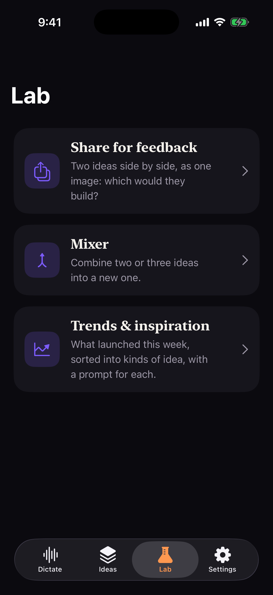 | 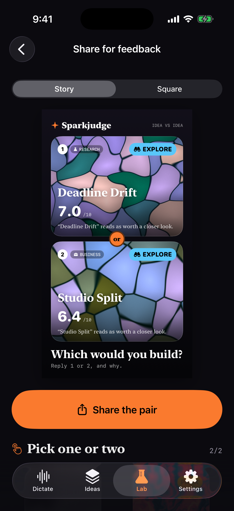 | 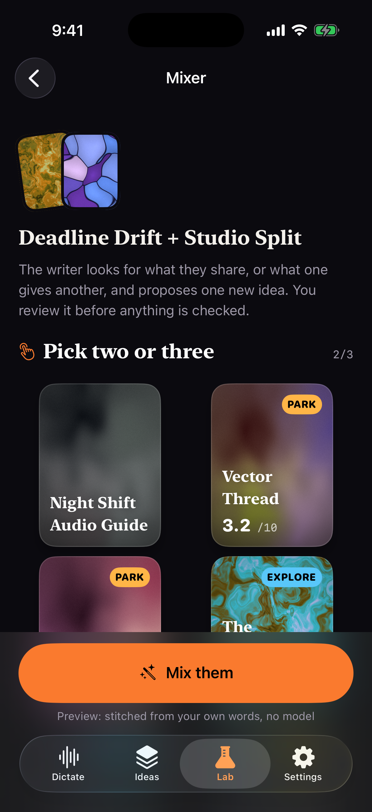 | 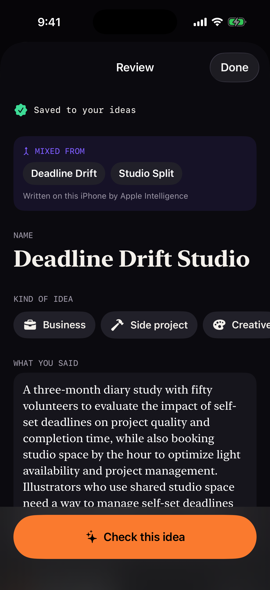 | 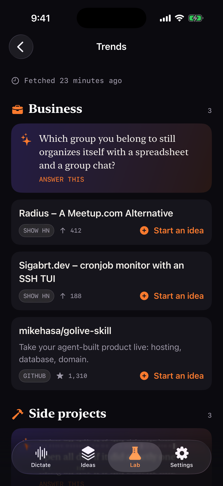 | 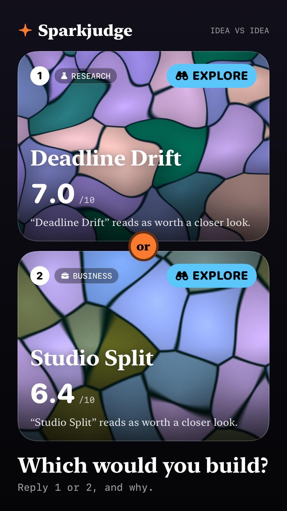 | 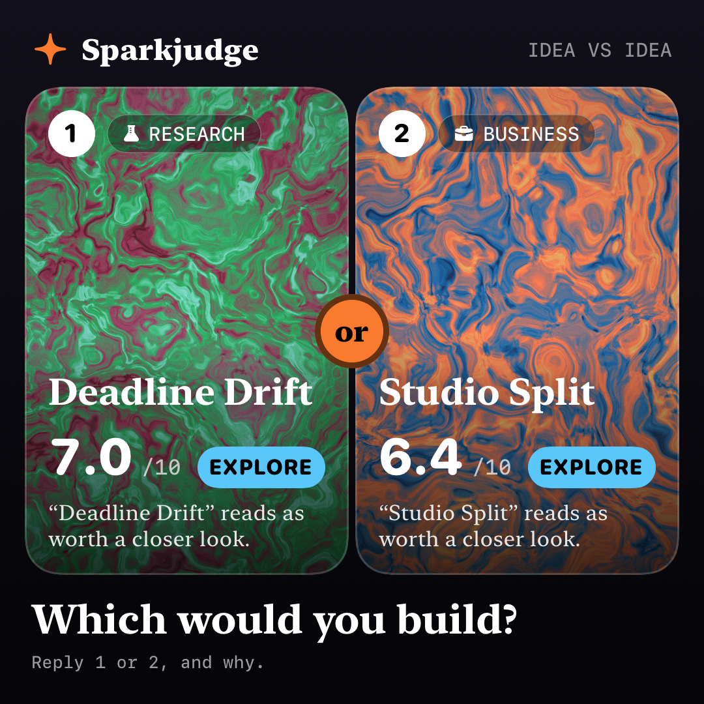 |

`mixed-on-device.png` is a real Apple Intelligence mix on the simulator;
`trends-live.png` is the Trends screen against `make api` (real sources, mock
judge, offline writer).

## Build

The Xcode project is generated from `project.yml`. It is not committed, so there
is one source of truth and no merge conflicts in a `.pbxproj`.

```sh
cd apps/ios
xcodegen generate
xcodebuild -scheme Sparkjudge -destination 'platform=iOS Simulator,name=iPhone 16 Pro' build test
open Sparkjudge.xcodeproj
```

You need Xcode 26 with the iOS 26 SDK, plus the Metal Toolchain
(`xcodebuild -downloadComponent MetalToolchain`) for the shaders, and Go: the
app links the check itself, `build/Sparkcore.xcframework` (`make mobile` at the
repository root). The scheme's build pre-action runs `scripts/sparkcore.sh`,
which rebuilds it when it is missing or older than any `.go`, `.yaml`, `.tmpl`
or `.md` under `ideacheck/ judge/ rubric/ prompt/ configs/ mobile/` (about
25 s; up to date it is one `find`), logging to `build/sparkcore.log`. It runs
before Xcode plans the build because the app copies the framework in before its
own phases; the `Sparkcore` target checks again and fails a build that had to
rebuild it late (build again). The app also compiles `mobile/swift/*.swift`
(the Swift judges) and the local package `Packages/LayaKit`. The deployment
target is iOS 26.0, so the simulator must run iOS 26 (an iOS 18 "iPhone 16 Pro"
will not match). There is no team id: it is set up for simulator builds. Set
`DEVELOPMENT_TEAM` in `project.yml` to run it on a phone.

`scripts/screenshots.sh <simulator-udid>` launches the built app with demo data
and captures every screen. `scripts/make-icon.swift` draws the app icon.

## Layout

```
Sparkjudge/
  App/        entry point, root tabs, settings keys, launch arguments, sample data
  Model/      Idea (SwiftData), categories, the fields catalogue, grouping for list/pile views
  Checking/   IdeaChecker protocol, CheckResult (mirrors schemas/check_result.schema.json),
              RemoteChecker (POST /v1/check?async=1 + SSE), PreviewChecker,
              OnDeviceChecker (the Go core on the phone), OnDeviceJudge (which judge, which route,
              engine settings), OnDeviceJudges (Apple Intelligence, Laya on disk and on the Hub,
              downloads), CheckProgressPlan (core events → progress, "Scoring 3 of 12"),
              CheckCoordinator (runs checks, writes results onto ideas)
  Speech/     Transcriber protocol, AppleSpeechTranscriber (SpeechAnalyzer), SilenceGate,
              LevelMeter/LevelSmoother, TranscriberCatalog (what this device supports), DictationModel
  Writer/     Foundation Models writer: @Generable IdeaNotes → title, category, fields
  Style/      theme, OKLCH, CardStyle (seed → palette + pattern), Entitlements
  Shaders/    Orb.metal (the dictate orb), Card.metal (six card families), SparkNoise.h
  Views/      Dictate, Review, Ideas (list + piles), Detail, Settings, Lab (+ IdeaPicker),
              Share (graphic, renderer, export background), Mixer (+ OriginLine), Trends
  Resources/  fields.json (= `ideacheck fields -o json`), SampleResult.json, SampleTrends.json,
              writer_instructions.md, mixer_instructions.md, mixer_prompt.md
SparkjudgeTests/  Swift Testing; Fixtures/check_result_mock.json is a real engine result
```

## How the pieces fit

- **Never lose an idea.** The take is inserted and saved in SwiftData the moment
  it ends, before review opens. Leaving the app mid-take ends the take and saves
  it too. The model is CloudKit-compatible: every property is optional or has a
  default, and nothing is unique. CloudKit sync is not turned on yet.
- **Transcription.** `Transcriber` is the plug-in point. `AppleSpeechTranscriber`
  feeds an `AVAudioEngine` tap, converted to `SpeechAnalyzer.bestAvailableAudioFormat`,
  into a `SpeechAnalyzer` with a `SpeechTranscriber` (or `DictationTranscriber`
  on hardware where `SpeechTranscriber.isAvailable` is false) plus a
  `SpeechDetector` for voice activity. Models download through
  `AssetInventory.assetInstallationRequest`. The Settings picker comes from
  `isAvailable`, `supportedLocales`/`installedLocales` and
  `AssetInventory.status(forModules:)`. WhisperKit (four sizes) and Parakeet are
  listed as "coming soon". WhisperKit was left out of this MVP so that the build
  has no network-fetched dependencies. It fits behind the same protocol.
- **Silence cutoff.** `SilenceGate` is a pure function over (level, voice
  activity, time). Once the person has spoken, *N* seconds with no speech end the
  take (the default is 2 s, set in Settings). If nothing is said for 12 s, the
  take gives up. The level is RMS → dBFS → 0…1, smoothed with separate attack and
  release times, and it drives both the gate and the orb's uniform.
- **Review.** `OnDeviceWriter` checks `SystemLanguageModel.default.availability`
  and `supportsLocale()`. When the model is available, it fills a `@Generable`
  struct, and only fields that are still empty are filled. When it is not
  available, the reason is shown and you fill the fields in yourself. The field
  meanings come from the bundled `fields.json`, the same catalogue the engine's
  extraction prompt reads.
- **Checking.** `IdeaChecker.check(intake, rubric:)` returns an
  `AsyncThrowingStream` of `.accepted`, `.progress` and exactly one `.result`.
  `RemoteChecker` talks to `ideacheck serve`: the server URL is set in Settings,
  and the default is `http://127.0.0.1:8080`. On a phone, use the Mac's LAN
  address; ATS allows local networking. A category you pick in review is sent as
  `?rubric=`. "Let the check decide" leaves the choice to the router.
  `PreviewChecker` builds a deterministic result on top of a real engine result.
  `OnDeviceChecker` runs the check on the phone (below).
- **Cards.** `CardStyle.make(seed:allowed:)` works as follows: the seed is
  FNV-1a over the idea's UUID, and SplitMix64 rolls the family, an OKLCH palette
  (a base hue plus a harmony), the warp, offset, scale, angle and a frozen phase.
  Free users get Nebula (domain-warped fbm), Cells (voronoi) and Mesh (a gradient
  mesh). Contour, Ripple and Aurora are Pro. `Entitlements.isPro` is a developer
  switch until StoreKit is added. Unchecked ideas are drawn nearly grey, and they
  get their colors when they are checked. Only the Detail hero card runs the
  shader clock. Cards in lists and piles freeze time and draw once through
  `.drawingGroup()`.

## On this iPhone

| Checking | Result | Judge settings | Downloading Laya |
|---|---|---|---|
| 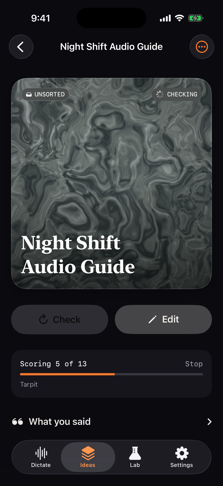 | 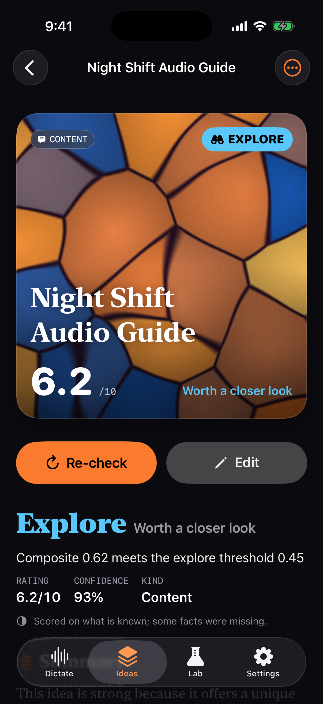 | 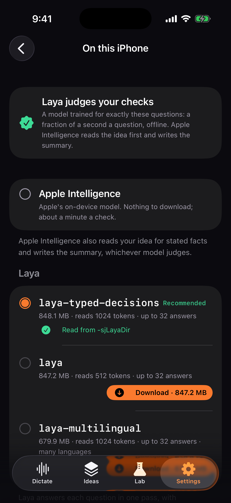 | 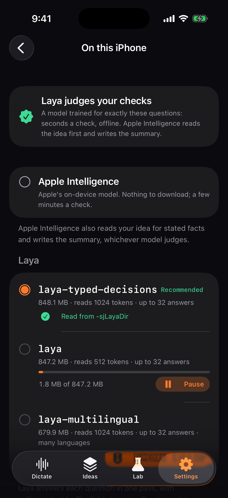 |

Real checks in the simulator: progress with Laya, the result with Apple
Intelligence judging (`on-device-result-laya.png` is Laya's, on the same idea).

The free tier checks on the phone, offline. `OnDeviceChecker` builds a
`SparkcoreEngine` (the Go core, `mobile/`) per check on a thread of its own and
maps its events onto `CheckEvent.progress` and its result JSON onto
`CheckResult`; cancelling the check's task calls `SparkcoreCheck.cancel`. The
category chosen in Review goes in as `rubric`, as for Cloud.

- **Judge.** Laya on Core ML (`LayaDeviceJudge`, via `Packages/LayaKit`) or
  Apple Intelligence (`FoundationJudge`), from what the phone has
  (`JudgeResolver`): the one picked in Settings while it is usable; else a
  downloaded typed-decisions checkpoint, then Apple Intelligence, then any other
  downloaded checkpoint that can hold an idea; else none, and Review's Check
  explains how to get one (download Laya, or check with Cloud). Laya is loaded
  (the first time compiled) before the first question, as the "Loading the
  judge" step. `FoundationJudge` answers each stage's questions in one guided
  response (the core's `BatchJudge`), falling back to one at a time.
- **Writer.** Apple Intelligence reads the idea for stated facts and writes the
  summary when it is available; otherwise both steps are off.
- **Settings → Model on this iPhone** lists Apple Intelligence (with why it is
  unavailable, when it is) and the Laya checkpoints the Hugging Face Hub lists
  now (`LayaDownloader.available()`), each with its download size, context and
  answers from its manifest. Checkpoints too small for an idea (the Neural Engine
  exports read 96 tokens, "snake" 64 with 4 answers) are listed apart, never
  offered. A download shows its progress, pauses and resumes, checks free space,
  and ends by loading the model; a downloaded one shows its size on disk and can
  be removed. Review offers Laya once, when Apple Intelligence is about to judge.
- **Routing.** No choice stored: free users check on the phone, Pro users in
  Sparkjudge Cloud (`CheckRoute`). A free user who picks Cloud spends the
  monthly free hosted checks, as before.
- **Memory.** Both configurations carry
  `com.apple.developer.kernel.increased-memory-limit` (Laya holds ~1 GB); on a
  device the App ID needs the Increased Memory Limit capability.

Measured in the iPhone 16 Pro simulator on this Mac (Core ML on the CPU there;
a phone runs Laya on the GPU in milliseconds a question):

| Judge | Whole check | Of which |
|---|---|---|
| Laya (typed decisions) + Apple writer | 56 s | load 2.5 s, extract 7.6 s, gaps 5.3 s, 13 questions 25.7 s, summary 14.9 s |
| Apple Intelligence, judge and writer | 54 s | extract 26.6 s, gaps 7.7 s, 13 questions 8.7 s, summary 11.1 s |
| Apple Intelligence, one question per call | 123 s | 13 questions 85.6 s (mobile/swiftcheck) |

## The Lab

- **Share for feedback.** Pick one idea or two; `ShareGraphic` lays them out as
  a story (9:16, 1080 × 1920) or a square (1:1, 1080 × 1080): each card's seeded
  background, name, category, rating /10, verdict, one line of why (the
  summary's first sentence, else the verdict's reason), "Which would you
  build?" and the wordmark. `ShareRenderer` draws it with `ImageRenderer` at 3×
  and hands it to `ShareLink`. `ImageRenderer` does draw the Metal card shader
  (verified on the iOS 26 simulator, pinned by `imageRendererDrawsTheShader`);
  should a device draw it flat, the renderer notices and redraws the cards with
  `ExportBackground`, a MeshGradient over the same seed's palette. Detail's
  menu shares one idea.
- **Mixer.** Pick two or three ideas; a writer proposes one that combines them
  (`MixedIdea`: title, problem, audience, solution), and it opens in Review as a
  new draft with a "Mixed from" line (`IdeaOrigin`, stored as `Idea.originData`)
  whose names open the parents. Writers, in order: Apple's on-device model
  (`@Generable MixNotes`; instructions and prompt are the bundled
  `mixer_instructions.md` / `mixer_prompt.md`), else the hosted API's
  `POST /v1/mix` for Pro, else none. `-checker preview` stitches instead.
- **Trends.** `GET /v1/trends` on the hosted API (at the server URL in
  Settings): items from Show HN, Hacker News, GitHub and news searches, typed by
  the judge into the same categories, plus a prompt per category. The last
  report is kept in Caches and shown first, with when it was fetched; offline it
  stays. "Start an idea" (or a prompt's "Answer this") opens Review with a draft
  that remembers the trend.

## Sparkjudge Cloud and Pro

| Paywall | Plan in Settings | Quota used |
|---|---|---|
| 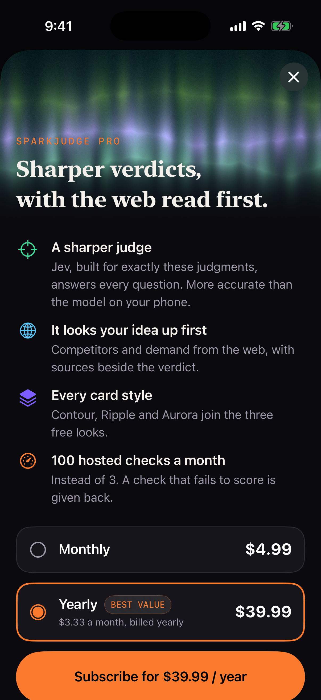 | 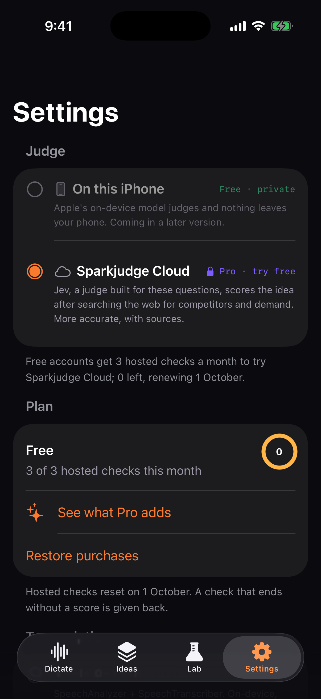 | 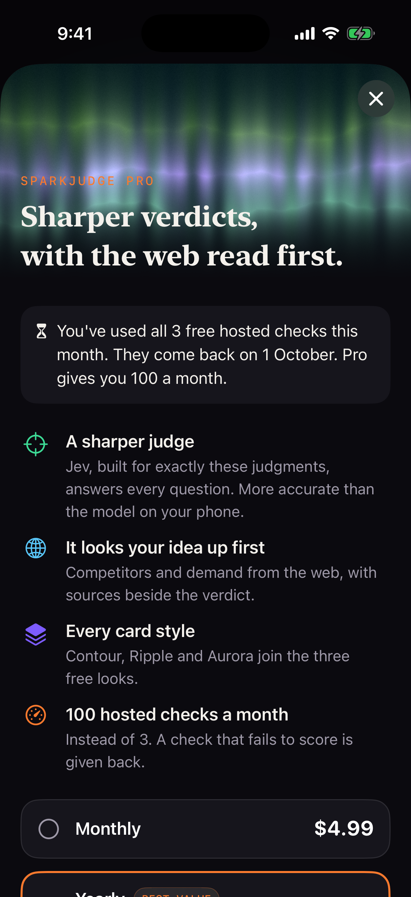 |

- **Hosted checks** go to the hosted API (`docs/sparkjudge-api.md`) through
  `SparkjudgeAPI`, an actor that sends one request at a time. The user id is a
  UUID in the Keychain (also RevenueCat's `appUserID`). With App Attest it
  attests a key once, then signs `METHOD\nPATH?QUERY\nhex(SHA256(body))` on every
  request; `stale_assertion` is re-signed once, `unknown_key` re-attested once.
  A Debug build talking to a dev server (`make api`, attest off) sends the user
  id alone; Release always attests. The URL is `SPARKJUDGE_API_URL` in
  `project.yml` (Debug: `http://127.0.0.1:8787`); Debug can override it in
  Settings → Developer.
- **Pro** is RevenueCat's `pro` entitlement, cached, or `/v1/me` saying `pro`.
  Put the SDK key in `Config/Secrets.xcconfig` (`REVENUECAT_API_KEY = appl_…`,
  git-ignored). Without it the paywall lists StoreKit's products
  (`StoreKit/Sparkjudge.storekit`, attached to the scheme's Run action) and says
  purchases are not connected.
- **On a device** you need a team id, the App Attest capability on the App ID
  (Release signs with `Sparkjudge.entitlements`, environment `production`), the
  RevenueCat key and products `com.morethancoder.sparkjudge.pro.monthly|yearly`
  in an offering.
- Debug-only launch arguments: `-sjPaywall quota|cloud|styles|browse`,
  `-sjDemoPlans YES` (sample plans outside Xcode), `-sjHostedChecks N` (check the
  N newest ideas; with `make api` running, `-sjSeed YES -sjHostedChecks 4` shows
  the free quota running out).

## Launch arguments

Launch arguments come in through UserDefaults' argument domain, so any settings
key works too (for example `-checker preview` or `-ideasLayout pile`).

| Argument | Effect |
|---|---|
| `-sjSeed YES` | in-memory store with sample ideas (one of them carries the real engine result) |
| `-sjTab ideas\|dictate\|lab\|settings` | start on a tab |
| `-sjOpen review\|detail\|pile:<category>` | open the sample draft's review, the best idea's detail, or a pile |
| `-sjOpen lab:share\|mixer\|trends\|mix` | open a Lab screen (with `-sjTab lab`); `mix` mixes the two best ideas and opens the result |
| `-sjExportShare YES` / `-sjShareFormat square` | write each rendered share image to Documents; start on the square format |
| `-labUserID <uuid>` | the `X-App-User-Id` the Lab routes send (a stand-in until the paid tier's identity) |
| `-sjDemoDictation YES` / `-sjAutoDictate YES` | a scripted voice in place of the microphone, and start a take on launch |
| `-sjScheme dark\|light` | force the appearance |
| `-sjOpen check` | open the newest unchecked idea and check it with the chosen checker |
| `-sjOpen judge` | with `-sjTab settings`: the Model on this iPhone page |
| `-checker on_device\|remote\|preview` / `-onDeviceJudge apple\|laya:<hub id>` | who checks, and which judge on the phone |
| `-sjLayaDir <path>` | Debug: a Laya checkpoint directory on the Mac, read in place of a download (the simulator reads host paths), e.g. `Packages/LayaKit/.models/laya-typed-decisions-coreml` |
| `-sjLayaDownload <hub id>` | Debug: start downloading that checkpoint on launch |

## What needs a device

The simulator runs everything except real dictation. It has no on-device
`SpeechTranscriber` (the picker says so and falls back to Dictation), its
microphone depends on the Mac, and Apple Intelligence is there only when the
Mac has it on (this Mac does: on-device checks with it run in the simulator).
Laya runs in the simulator on the CPU only; its speed on the GPU, the memory
limit and the download on a cellular connection need a phone. A denied or missing microphone shows a
calm message and offers "Type instead". To test live transcription, the orb's
response to a real voice, haptics and Foundation Models suggestions, use an
iPhone that supports Apple Intelligence.
